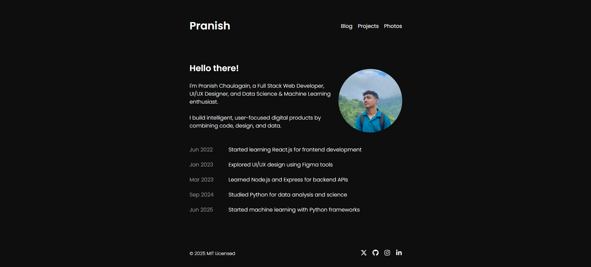

# 🌟 My Developer Portfolio

Welcome to my personal portfolio website! This is where I showcase my journey and projects across Full-Stack Web Development, UI/UX Design, Data Science, and Machine Learning. It's a reflection of my skills, passion for technology, and continuous learning mindset.

## 🧑‍💻 About Me

I'm a CS student with a deep interest in both software development and core scientific fields like mathematics and physics. I enjoy building modern web applications, designing thoughtful user experiences, and exploring the power of data and machine learning.

## 🚀 Tech Stack

### Frontend

- HTML, CSS, JavaScript
- React.js, Tailwind CSS
- Figma (for UI/UX design)

### Backend

- Node.js, Express.js
- MongoDB, REST APIs

### Data Science & ML

- Python, NumPy, Pandas, Matplotlib
- Scikit-learn, TensorFlow (beginner level)
- Jupyter Notebooks, Google Colab

### Tools

- Git, GitHub
- VS Code, Postman
- Vercel / Render

## 📸 Preview



## 🔧 Installation & Setup

To run this project locally:

```bash
git clone https://github.com/Pranish03/portfolio.git
cd portfolio
npm install
npm run dev
```
